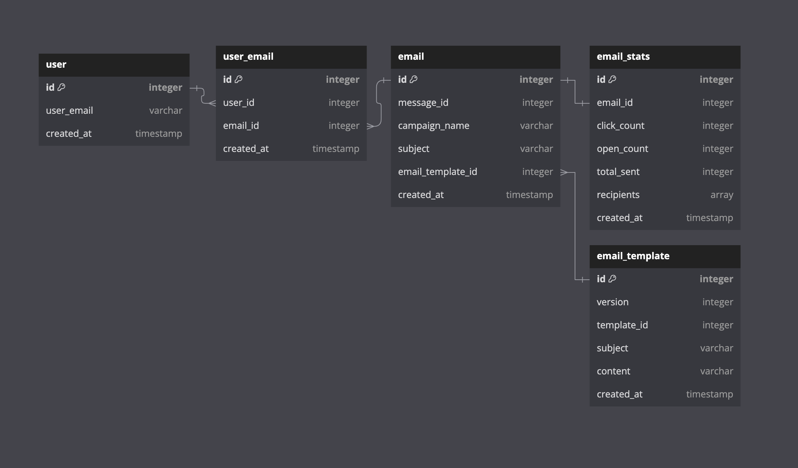

# Version-Controlled Transactional Email Service


## Features

- **Version-Controlled Email Templates**: Manage and store multiple versions of email templates for easy updates and rollbacks.

The most recent version of an email template is stored as the last element in the array associated with the templateId key.
```javascript
const EmailTemplates = {
  "templateId": [
    {
      id: Number,
      subject: String,
      version: String,
      content: String,
      sentStatus: Boolean,
      createdAt: Date,
    },
  ],
};
```

- **Email Tracking**: Monitor email performance with detailed statistics, including open rates, click counts, and total emails sent.
- **Multi-Recipient Support**: Send transactional emails to multiple recipients simultaneously.
- **Email Metadata Storage**: Maintain records of sent emails, associated campaigns, and user interactions.

## Database Schema

